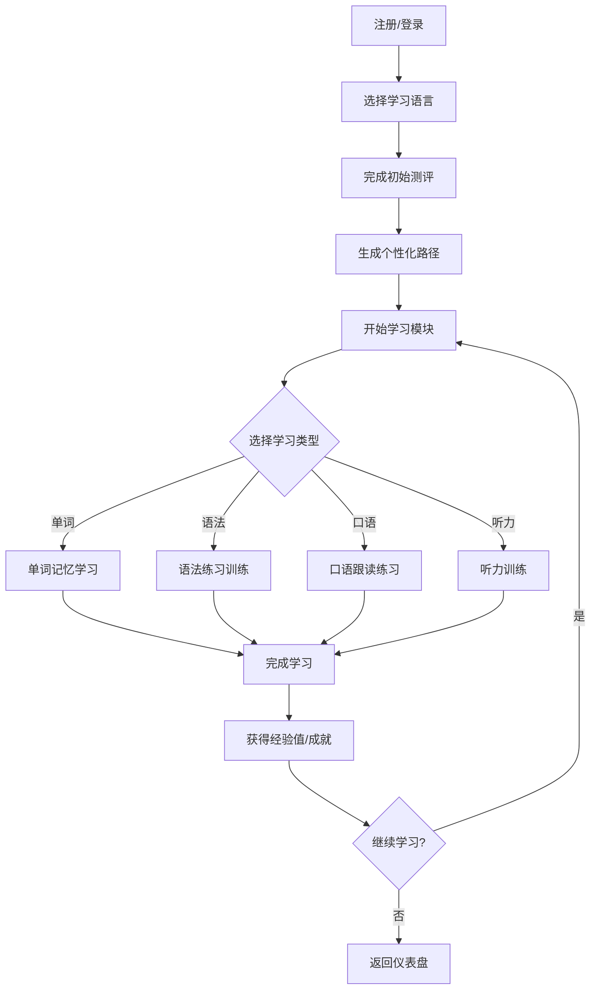
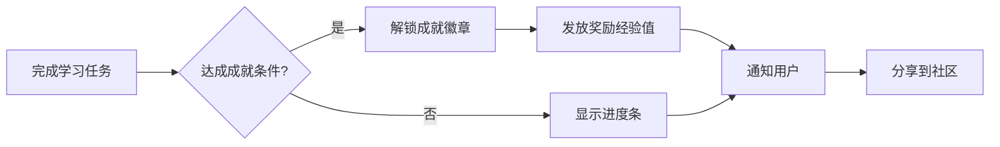

# 棱语言 - 多语种沉浸式学习平台 PRD

## 1. 产品概述

**项目名称：** LinguaHub（棱语言）

**一句话简介：** 一款支持英语、日语、韩语等多语种学习的沉浸式在线教育平台，通过互动式学习模块和个性化路径规划，让语言学习变得高效且有趣。

**目标用户：**
- 有外语学习需求的成人学习者（18-45岁）
- 想要提升职场竞争力的在职人士
- 计划出国旅游、留学的预备群体
- 语言爱好者

**核心价值：**
- 沉浸式学习体验，还原真实语言环境
- 游戏化成就系统，提升学习动力
- AI驱动的个性化学习路径

---

## 2. 核心功能模块

### 2.1 用户角色

| 角色 | 注册方式 | 核心权限 |
|------|----------|----------|
| 游客 | - | 浏览首页、试听公开课 |
| 注册用户 | 邮箱/手机号注册 | 使用全部学习功能、社区交流 |
| 管理员 | 系统分配 | 课程管理、用户管理、数据分析 |

### 2.2 功能模块列表

1. **首页/仪表盘** - 学习概览、今日目标、继续学习、推荐课程
2. **课程中心** - 分级课程体系、语言切换、学习路径
3. **学习模块** - 单词记忆、语法练习、口语跟读、听力训练
4. **进度追踪** - 学习统计、能力图谱、学习日历、成就徽章
5. **个人中心** - 账户设置、学习记录、错题本
6. **社区中心** - 学习小组、话题讨论、学习伙伴
7. **登录/注册** - 邮箱注册、登录、找回密码

### 2.3 页面详情

| 页面名称 | 模块名称 | 功能描述 |
|----------|----------|----------|
| 首页仪表盘 | 今日学习卡片 | 显示今日学习时长、单词数、连续天数 |
| 首页仪表盘 | 继续学习区 | 展示最近学习的课程章节，支持一键继续 |
| 首页仪表盘 | 推荐课程轮播 | 基于学习历史的个性化课程推荐 |
| 课程中心 | 语言切换器 | 英语/日语/韩语一键切换 |
| 课程中心 | 难度筛选 | 初级/中级/高级筛选 |
| 课程中心 | 课程卡片 | 课程封面、难度等级、学习人数、预计时长 |
| 课程详情 | 课程大纲 | 章节列表、学习目标、知识点预览 |
| 学习模块 | 单词记忆 | 闪卡记忆、拼写测试、艾宾浩斯复习 |
| 学习模块 | 语法练习 | 填空题、判断题、排序题、情境选择题 |
| 学习模块 | 口语跟读 | 语音评分、波形对比、逐句模仿 |
| 学习模块 | 听力训练 | 音频播放、听写填空、选项选择 |
| 进度追踪 | 能力雷达图 | 听说读写四维能力可视化 |
| 进度追踪 | 学习日历 | 每日学习打卡热力图 |
| 进度追踪 | 成就徽章墙 | 已获得/未获得徽章展示 |
| 社区中心 | 学习小组 | 按语言/难度/话题组建的小组 |
| 社区中心 | 话题广场 | 热门话题讨论、帖子发布 |
| 个人中心 | 学习报告 | 周报/月报生成、薄弱点分析 |

---

## 3. 核心流程

### 3.1 用户学习流程

### 3.2 成就激励流程

---

## 4. 用户界面设计

### 4.1 设计风格

**整体风格：** 现代极简 + 温暖渐变 + 游戏化元素

**色彩体系：**
| 用途 | 颜色名称 | 色值 |
|------|----------|------|
| 主色 | 珊瑚橙 | #FF6B6B |
| 辅色 | 深空蓝 | #4ECDC4 |
| 强调色 | 荧光黄 | #FFE66D |
| 背景色 | 柔光白 | #F8F9FA |
| 深色背景 | 暗夜蓝 | #1A1A2E |
| 文字主色 | 墨玉黑 | #2D3436 |
| 文字辅色 | 烟灰 | #636E72 |

**字体选择：**
- 标题：思源黑体 Bold / Noto Sans SC Bold
- 正文：Inter / 思源黑体 Regular
- 数字/统计：DM Sans

**布局方式：**
- 桌面端：侧边导航 + 主内容区
- 移动端：底部Tab导航 + 卡片式布局

**动效风格：**
- 页面切换：淡入淡出 + 微弹跳
- 成就解锁：粒子爆发 + 徽章翻转
- 学习进度：流畅填充动画
- 卡片悬停：轻微上浮 + 阴影加深

**图标风格：** Lucide Icons / 自定义SVG线性图标

### 4.2 页面UI元素详情

| 页面 | 模块 | UI元素 | 动效 |
|------|------|--------|------|
| 首页 | 今日卡片 | 圆角卡片、渐变背景、学习数据环形图 | 数字滚动动画 |
| 首页 | 继续学习 | 课程封面图、进度条、播放按钮 | 悬停放大1.02 |
| 课程中心 | 课程卡片 | 封面图、难度标签、人数统计 | 悬停上浮6px+阴影 |
| 学习模块 | 单词卡 | 翻转卡片、发音按钮、记忆曲线 | 3D翻转动画 |
| 学习模块 | 练习区 | 题目卡片、选项按钮、提交反馈 | 正确绿闪/错误红震 |
| 进度页 | 雷达图 | 四维能力图、动画绘制 | 路径动画绘制 |
| 成就页 | 徽章墙 | 3D徽章展示、获得/锁定状态 | 获得时3D旋转 |
| 社区页 | 帖子卡片 | 用户头像、帖子摘要、点赞评论 | 点赞数字跳动 |

### 4.3 响应式策略

- **桌面端（>1200px）：** 侧边导航展开，三栏布局
- **平板端（768-1200px）：** 侧边导航收起，两栏布局
- **移动端（<768px）：** 底部Tab导航，单栏卡片流

---

## 5. 技术需求

### 5.1 前端技术栈

- React 18 + TypeScript
- Tailwind CSS 3
- Vite 构建工具
- React Router 路由管理
- Zustand 状态管理
- Framer Motion 动画库

### 5.2 数据存储

- LocalStorage 存储用户偏好和本地进度
- Mock Data 模拟后端API数据

### 5.3 第三方服务

- Web Speech API（口语评测、语音识别）
- Chart.js / Recharts（数据可视化）
- Lucide React（图标库）

---

## 6. 验收标准

### 6.1 功能验收

- [ ] 用户可完成注册、登录、登出
- [ ] 可切换英语/日语/韩语三种语言
- [ ] 单词记忆模块可进行闪卡学习和测试
- [ ] 语法练习模块可完成选择题和填空题
- [ ] 口语跟读模块可录音并播放
- [ ] 听力训练模块可播放音频并作答
- [ ] 进度追踪显示学习数据和成就
- [ ] 社区页面可浏览和发布话题
- [ ] 个性化推荐根据学习历史生成

### 6.2 视觉验收

- [ ] 整体设计风格现代、温暖、有学习氛围
- [ ] 动效流畅，无明显卡顿
- [ ] 响应式布局适配桌面和移动端
- [ ] 成就系统有吸引力和仪式感
