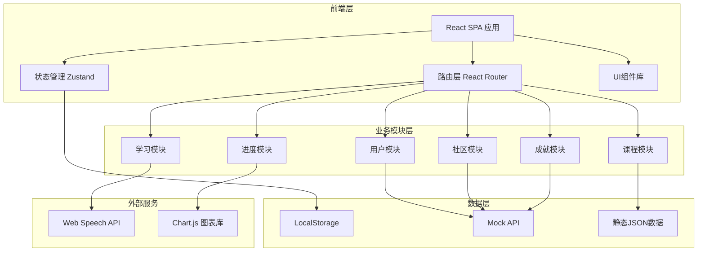

# 棱语言 - 技术架构文档

## 1. 架构设计

### 1.1 整体架构图



### 1.2 技术栈

| 类别 | 技术选型 | 版本 |
|------|----------|------|
| 框架 | React | 18.x |
| 语言 | TypeScript | 5.x |
| 构建工具 | Vite | 5.x |
| 样式 | Tailwind CSS | 3.x |
| 路由 | React Router DOM | 6.x |
| 状态管理 | Zustand | 4.x |
| 动画 | Framer Motion | 11.x |
| 图表 | Recharts | 2.x |
| 图标 | Lucide React | 最新 |
| 音频 | Web Speech API | - |

---

## 2. 路由定义

| 路由路径 | 页面名称 | 描述 |
|----------|----------|------|
| `/` | 首页仪表盘 | 学习概览、继续学习、推荐课程 |
| `/login` | 登录页 | 用户登录 |
| `/register` | 注册页 | 用户注册 |
| `/courses` | 课程中心 | 全部课程列表 |
| `/courses/:courseId` | 课程详情 | 课程章节和学习内容 |
| `/learn/:moduleType` | 学习模块 | 单词/语法/口语/听力 |
| `/progress` | 进度追踪 | 学习统计和能力图谱 |
| `/community` | 社区中心 | 话题广场和学习小组 |
| `/profile` | 个人中心 | 账户设置和学习报告 |
| `/achievements` | 成就中心 | 徽章墙和成就列表 |

---

## 3. 数据模型

### 3.1 用户数据模型

```typescript
interface User {
  id: string;
  email: string;
  nickname: string;
  avatar: string;
  nativeLanguage: 'zh' | 'en' | 'ja' | 'ko';
  targetLanguages: ('en' | 'ja' | 'ko')[];
  level: number;
  experience: number;
  streak: number; // 连续学习天数
  createdAt: string;
}
```

### 3.2 课程数据模型

```typescript
interface Course {
  id: string;
  language: 'en' | 'ja' | 'ko';
  title: string;
  description: string;
  coverImage: string;
  difficulty: 'beginner' | 'intermediate' | 'advanced';
  duration: number; // 预计学习时长（分钟）
  totalLessons: number;
  enrolledCount: number;
  chapters: Chapter[];
}

interface Chapter {
  id: string;
  title: string;
  lessons: Lesson[];
}

interface Lesson {
  id: string;
  title: string;
  type: 'vocabulary' | 'grammar' | 'speaking' | 'listening';
  duration: number;
  content: LessonContent;
}
```

### 3.3 学习进度模型

```typescript
interface LearningProgress {
  oduleType: 'vocabulary' | 'grammar' | 'speaking' | 'listening';
  courseId: string;
  lessonId: string;
  completed: boolean;
  score: number;
  timeSpent: number; // 学习时长（秒）
  lastStudied: string;
}
```

### 3.4 成就数据模型

```typescript
interface Achievement {
  id: string;
  title: string;
  description: string;
  icon: string;
  condition: AchievementCondition;
  reward: number; // 经验值奖励
}

interface UserAchievement {
  achievementId: string;
  unlockedAt: string;
  notified: boolean;
}
```

---

## 4. 页面组件结构

```
src/
├── components/
│   ├── layout/
│   │   ├── Sidebar.tsx        # 侧边导航
│   │   ├── Header.tsx         # 顶部栏
│   │   └── MobileNav.tsx      # 移动端底部导航
│   ├── common/
│   │   ├── Button.tsx
│   │   ├── Card.tsx
│   │   ├── Modal.tsx
│   │   ├── ProgressBar.tsx
│   │   └── Avatar.tsx
│   ├── course/
│   │   ├── CourseCard.tsx
│   │   ├── ChapterList.tsx
│   │   └── LessonItem.tsx
│   ├── learning/
│   │   ├── FlashCard.tsx      # 单词闪卡
│   │   ├── GrammarExercise.tsx
│   │   ├── SpeakingRecorder.tsx
│   │   └── AudioPlayer.tsx
│   ├── progress/
│   │   ├── RadarChart.tsx
│   │   ├── CalendarHeatmap.tsx
│   │   └── StatCard.tsx
│   ├── community/
│   │   ├── PostCard.tsx
│   │   └── GroupCard.tsx
│   └── achievement/
│       ├── BadgeGrid.tsx
│       └── AchievementCard.tsx
├── pages/
│   ├── HomePage.tsx
│   ├── LoginPage.tsx
│   ├── RegisterPage.tsx
│   ├── CoursesPage.tsx
│   ├── CourseDetailPage.tsx
│   ├── LearningPage.tsx
│   ├── ProgressPage.tsx
│   ├── CommunityPage.tsx
│   ├── ProfilePage.tsx
│   └── AchievementsPage.tsx
├── hooks/
│   ├── useAuth.ts
│   ├── useCourses.ts
│   ├── useProgress.ts
│   └── useSpeech.ts
├── store/
│   ├── authStore.ts
│   ├── courseStore.ts
│   ├── progressStore.ts
│   └── achievementStore.ts
├── data/
│   ├── courses.ts             # 模拟课程数据
│   ├── achievements.ts        # 模拟成就数据
│   └── mockPosts.ts           # 模拟社区帖子
└── utils/
    ├── storage.ts              # LocalStorage封装
    └── speech.ts               # 语音API封装
```

---

## 5. 状态管理设计

### 5.1 Auth Store

```typescript
interface AuthState {
  user: User | null;
  isAuthenticated: boolean;
  login: (email: string, password: string) => Promise<void>;
  register: (data: RegisterData) => Promise<void>;
  logout: () => void;
}
```

### 5.2 Course Store

```typescript
interface CourseState {
  courses: Course[];
  currentCourse: Course | null;
  selectedLanguage: 'en' | 'ja' | 'ko';
  filter: { language?: string; difficulty?: string };
  setCourses: (courses: Course[]) => void;
  selectCourse: (courseId: string) => void;
  setLanguage: (lang: 'en' | 'ja' | 'ko') => void;
}
```

### 5.3 Progress Store

```typescript
interface ProgressState {
  progress: LearningProgress[];
  stats: {
    totalTime: number;
    wordsLearned: number;
    streak: number;
    level: number;
  };
  addProgress: (progress: LearningProgress) => void;
  getProgressByCourse: (courseId: string) => LearningProgress[];
}
```

---

## 6. Mock 数据结构

### 6.1 课程数据

- 英语课程：3门（初/中/高级各1）
- 日语课程：2门（初级1门、中级1门）
- 韩语课程：2门（初级1门、中级1门）

每门课程包含4-6个章节，每章节包含3-5个课时。

### 6.2 成就列表

- 新手启程：完成第一个课程
- 单词达人：累计学习100个单词
- 语法专家：完成50道语法题
- 口语新星：完成10次口语练习
- 听力达人：完成20次听力训练
- 连续7天：保持7天连续学习
- 连续30天：保持30天连续学习
- 学习里程：累计学习100小时

---

## 7. 性能优化

- 路由懒加载：使用 React.lazy 进行页面级代码分割
- 图片优化：使用 WebP 格式，懒加载
- 动画性能：使用 transform 和 opacity 动画
- 状态持久化：仅在必要时写入 LocalStorage
